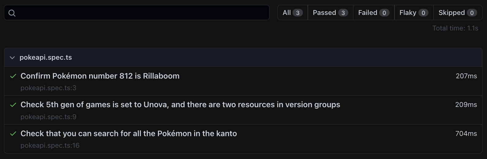

<div align="center">
<h1 align="center">API automation framework using <a href="https://playwright.dev/">Playwright</a> and Typescript to test the <a href="https://pokeapi.co//">PokeAPI</a> API</h1>
</div>

## Test Scenarios Covered
* Confirm Pokémon number 812 is Rillaboom
* Check 5th gen of games is set to Unova, and there are two resources in version groups
* Check that you can search for all the Pokémon in  the kanto

## Usage
Clone the repository and run the following command:

```sh
npm install
```

## Run tests

```sh
npm test
```
Then, to open report run the following command:

```sh
npm run report
```

It will open default browser and open the HTML report
